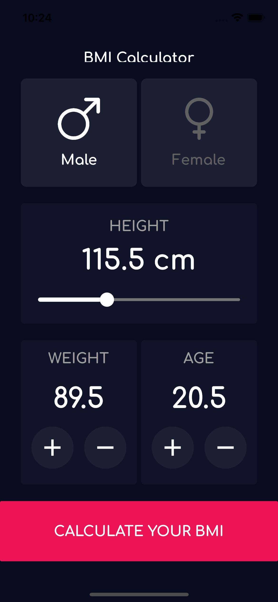
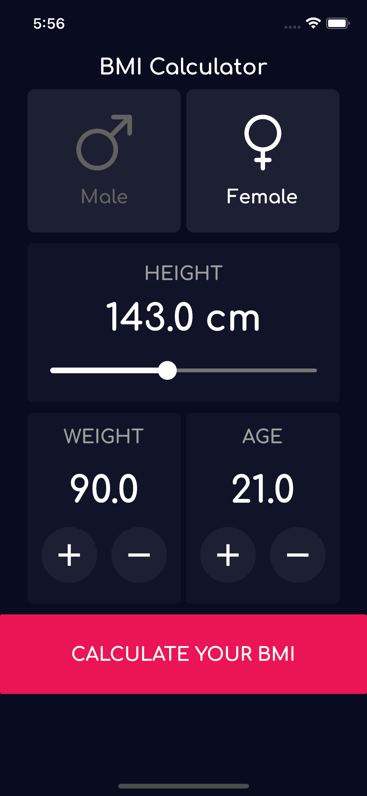

# BMI-Calculator

Flutter Mobile Application for Android/IOS

Calculate your Body Mass Index, based on information from this Wikipedia page,
    => Link : https://en.wikipedia.org/wiki/Body_mass_index.

# Concepts Used:
- OOP
- Widgets Seperation
- Widgets reutilization
- Using Andoird/iOS Platform-Specific Widgets
- Widgets Decomposition 
- Themes.

# Packages/Tools used:
- Google Fonts
- Icon Creation for Android/IOS
- Splash Screen creation for Android/iOS
